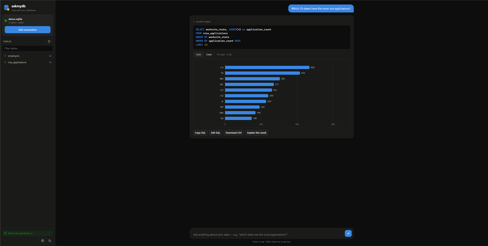
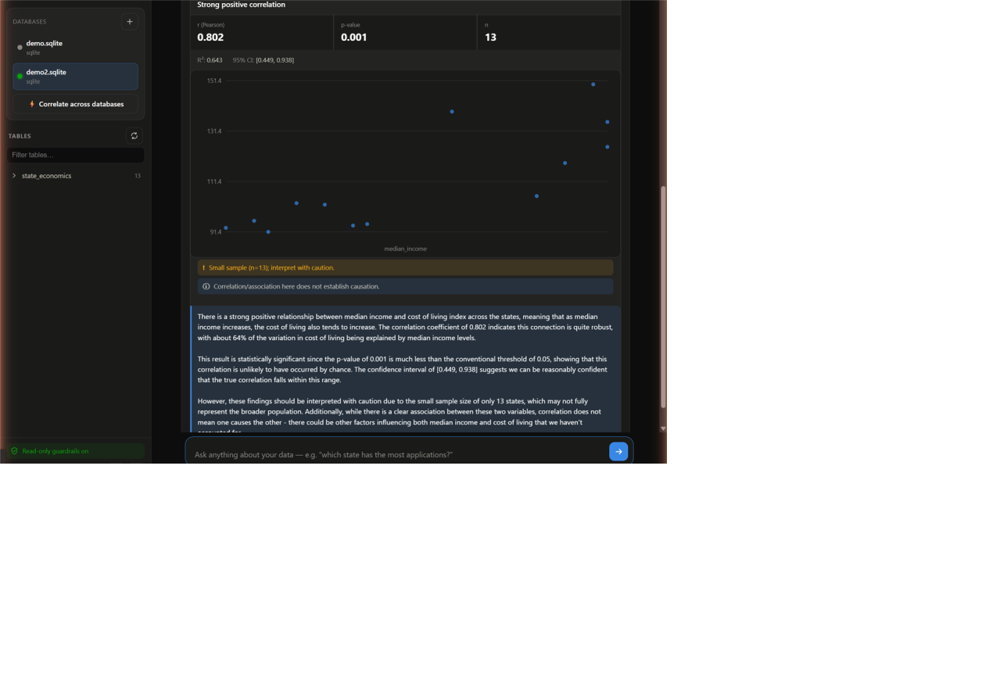

# askmydb 🛢️✨

**Chat with your own data — database *or spreadsheets* — using an AI that runs entirely on
your own computer.**

Type a question like *“Which companies have the highest approval rate?”* — askmydb sends your
schema and the question to a local model (LM Studio, Ollama, or any OpenAI-compatible server),
the model writes the SQL, askmydb runs it **read-only**, and you get back a table, a chart, and
a plain-English explanation.

Don’t have a database? **Just drop in CSV or Excel files** — each becomes a queryable table, so
you can ask questions across a main spreadsheet and its associated ones without any database
setup at all.

No cloud. No data uploaded anywhere. It all stays on your machine.



Ask a question, then hit **📊 Analyze** — askmydb suggests the right statistical test, computes
it, flags the caveats, and explains the result in plain English:



## What it does

- **Spreadsheets & CSVs, no database needed** — pick “Spreadsheets / CSV files”, drag in your
  `.csv` / `.xlsx` files (or point at them by path), and each file — and each Excel sheet —
  becomes a table. Column types are inferred (numbers, currency like `$95,000`, dates), while
  ZIP codes and case numbers are kept as text so leading zeros aren’t lost. Then ask questions
  that join across files.
- **Schema discovery** — point it at your database and it maps every table, column,
  primary key, and foreign-key relationship automatically. It even samples a few example
  values from text columns (`'TX'`, `'Certified'`, …) so the model writes better WHERE clauses.
- **Ask in English** — a chat UI turns questions into SQL. Follow-up questions work
  (“now just for California”). If a query fails, the model sees the error and fixes itself.
- **Multiple databases at once** — connect several databases (any mix of MySQL, Postgres,
  and SQLite) and switch between them. Add them from the sidebar.
- **Correlate across databases** — you can’t `JOIN` across separate database servers, so
  askmydb pulls the two result sets into a private local store, joins them on a shared key,
  and runs the correlation there. Sales in your MySQL vs. spend in your Postgres, joined on
  region — no data leaves your machine.
- **Deep statistical analysis** — an “📊 Analyze” button on any result. It **suggests the
  most relevant analyses and explains why**, then computes them: correlation (Pearson/
  Spearman), linear & multiple regression, t-tests, ANOVA, chi-square, distributions,
  outliers, and trends — with confidence intervals, effect sizes, and p-values. Every result
  carries honest **statistical guardrails** (small-sample warnings, normality checks,
  multiple-comparison adjustment, and a standing “correlation ≠ causation” caveat).
- **Results your way** — sortable tables, automatic bar/line charts, scatter/histogram/
  heatmap charts for analyses, CSV export, and plain-English interpretation of every number.
- **Read-only guardrails** — multiple independent layers make sure nothing can write to
  your database (details below).
- **Works with what you have** — MySQL/MariaDB, PostgreSQL, or SQLite. LM Studio, Ollama,
  llama.cpp, vLLM — anything with an OpenAI-compatible API.

### Built for small, local models

Small models are unreliable at arithmetic and easily overwhelmed by a big schema, so askmydb
is designed around those limits:

- **Numbers are never left to the model.** Every statistic and p-value is computed in
  JavaScript; deterministic rules decide *which* analysis fits and *why*. The model is used
  only to narrate the already-computed numbers — so the analysis is correct and reproducible
  even with a weak 7B model (or with the model server offline).
- **Schema retrieval** (optional). Point askmydb at an embedding model too (e.g. LM Studio’s
  `nomic-embed-text`), and on a large database it embeds your tables and includes only the
  ones relevant to your question — instead of blowing past a small context window.
- **Self-consistency** (optional). Generate several SQL candidates and cross-check them, in
  Settings — trades speed for accuracy on tricky questions.

## Quickstart

**1. Get a local AI running** (skip if you already have one)

- Install [LM Studio](https://lmstudio.ai), download a model
  (a coding model like *Qwen2.5-Coder* or *Qwen3-Coder* works great — even the 7B sizes),
  then open the **Developer** tab and click **Start Server**.
- Or [Ollama](https://ollama.com): `ollama pull qwen2.5-coder` — the server URL is
  `http://localhost:11434/v1`.

**2. Start askmydb**

The easy way (no command line): download this folder, then **double-click `start.bat`**
(Windows) or **`start.sh`** (Mac/Linux). It installs what it needs the first time and opens
your browser. You’ll need [Node.js](https://nodejs.org) installed (the launcher links you to it
if it’s missing). Excel/CSV import and the demo need Node 22+.

Or from a terminal:

```bash
npm install
npm start
```

Open **http://localhost:3600** — a setup screen appears.

**3. Connect**

The setup screen opens on **Spreadsheets / CSV files** — drag your files in and you’re ready.
For a database instead, pick its type, fill in the details, and **Test connection**. Either way,
pick your model and **Save & connect**. askmydb discovers the tables and suggests starter
questions. That’s it — start asking.

### Working with spreadsheets & CSVs

Pick **Spreadsheets / CSV files**, drag in one or more `.csv` / `.xlsx` files (or add them by
path), and Save. Each file becomes a table; each sheet of an Excel workbook becomes its own
table. Then ask questions across them — e.g. with a main disclosure file plus an associated
lookup file, *“compare the average wage for employers at office vs apartment addresses”* joins
the two automatically. Edited a file? Hit the ⟳ refresh to re-import. Your files are read into a
local database on your machine and never uploaded anywhere.

### No database handy? Try the demo

```bash
npm run demo     # creates demo/demo.sqlite (visa applications) + demo/demo2.sqlite (state economics)
npm start
```

Connect with type **SQLite** and the file path the command prints, then ask things like
*“Which state has the most applications?”* or *“Show me the monthly application trend.”*

The demo creates **two** databases so you can try the cross-database feature: add both, run
“applications per state” on one and “median income per state” on the other, then click
**Correlate across databases** and join them on `state`.

## The guardrails

askmydb assumes the model can and will occasionally write bad SQL, so safety doesn't
depend on the model behaving:

| Layer | What it does |
|---|---|
| **Read-only session** | Every query runs in a database session set to read-only (`SET SESSION TRANSACTION READ ONLY` on MySQL, `default_transaction_read_only` on Postgres, a read-only file handle on SQLite). Even if a write slipped past every other check, the database itself refuses it. |
| **SQL validator** | Only a single `SELECT` / `WITH` / `SHOW` / `DESCRIBE` / `EXPLAIN` statement is accepted. Writes, DDL, multiple statements, `SELECT INTO`, writable CTEs, file functions (`LOAD_FILE`, `pg_read_file`…), locks, and sleep/benchmark functions are all rejected — and the validator strips comments and string literals first, so keywords can't be smuggled in (`SEL/**/ECT`) or falsely flagged (a column literally named `delete` is fine when quoted). |
| **Row cap** | A `LIMIT` is added (or capped) on every query — default 500 rows. |
| **Timeouts** | Queries are cancelled server-side after 15 s (configurable). |
| **Approval mode** | Optional: the app shows you the generated SQL and waits for your click before running anything. |
| **Sensitive-value filter** | Schema sampling never reads columns whose names look like passwords, tokens, emails, SSNs, card numbers, etc. You can also turn sampling off entirely. |
| **Localhost only** | The app binds to `127.0.0.1` — nobody else on your network can reach it. |

**One more layer we recommend: connect with a read-only database user.**

```sql
-- MySQL / MariaDB
CREATE USER 'askmydb'@'%' IDENTIFIED BY 'pick-a-password';
GRANT SELECT ON your_database.* TO 'askmydb'@'%';

-- PostgreSQL
CREATE ROLE askmydb LOGIN PASSWORD 'pick-a-password';
GRANT CONNECT ON DATABASE your_database TO askmydb;
GRANT USAGE ON SCHEMA public TO askmydb;
GRANT SELECT ON ALL TABLES IN SCHEMA public TO askmydb;
```

Run the guardrail test suite any time with `npm test`.

## Pointing it at your database

- **Local MySQL/Postgres**: host `localhost`, your database name, done.
- **Remote server** (e.g. the MySQL behind your website): use the server's host name and
  open the port to your IP — or better, keep the port closed and use an SSH tunnel:
  `ssh -L 3306:localhost:3306 you@yourserver.com`, then connect askmydb to
  `localhost:3306`.
- **SQLite**: just the file path.

Connection details are saved to `config.json` (which is `.gitignore`d — your password
never ends up in git).

## Giving it to someone else (no setup for them)

askmydb is just a folder. To hand it to a non-technical person:

1. Copy the folder (you can delete `node_modules`, `data/`, and `config.json` first to shrink it).
2. **Pre-fill their AI settings** so they don’t configure anything: copy
   [`config.example.json`](config.example.json) to `config.json` and fill in the `baseUrl`,
   `apiKey`, and `model` (see the next section to share your own AI). They can still add their
   own database/spreadsheets in the UI.
3. Send them the folder. They install [Node.js](https://nodejs.org) once, then **double-click
   `start.bat`** (Windows) or **`start.sh`** (Mac/Linux). A browser opens and they drag in their
   spreadsheets.

## Sharing your AI over the internet (Cloudflare tunnel)

Have a GPU and want to let a friend use *your* model? You can expose your LM Studio over a
Cloudflare tunnel — but **don’t point a public tunnel straight at LM Studio**: its server has no
authentication, so anyone with the URL could use your GPU. askmydb ships a tiny **auth proxy**
that fixes this.

1. Pick a secret key:
   `node -e "console.log(require('crypto').randomBytes(24).toString('hex'))"`
2. Run the proxy (it requires the key and forwards to LM Studio):
   - Windows: `set ASKMYDB_SHARE_KEY=your-key && npm run share-llm`
   - Mac/Linux: `ASKMYDB_SHARE_KEY=your-key npm run share-llm`
3. Point your Cloudflare tunnel at the **proxy** (`http://localhost:1235`), not LM Studio — see
   [`tools/cloudflared-config.example.yml`](tools/cloudflared-config.example.yml).
4. Your friend’s config uses **Server URL** `https://your-tunnel-hostname/v1` and **API key** =
   the secret key. (Put these in their `config.json` per the section above and they’re done.)

For a stronger, key-less option, protect the hostname with **Cloudflare Access** and give a
service token instead — askmydb sends it via `llm.headers` in `config.json` (example in the
cloudflared file above). Those header values are treated as secrets: they’re never shown to or
editable from the browser.

## Customizing

Everything is plain JavaScript — no build step, no framework. Edit and restart.

| Want to change… | Edit |
|---|---|
| **The prompts** (how the model is instructed) | [`prompts.js`](prompts.js) — one small file, heavily commented |
| **Colors / theme** | CSS variables at the top of [`public/style.css`](public/style.css) |
| **Guardrail limits** (rows, timeout, approval mode) | Settings ⚙ in the UI, or `config.json` |
| **Allowed/forbidden SQL** | [`src/guardrails.js`](src/guardrails.js) — the keyword lists are at the top |
| **Add a database dialect** | Drop an adapter in [`src/db/`](src/db) with `testConnection` / `getSchema` / `runQuery` / `quoteIdent`, register it in [`src/db/index.js`](src/db/index.js) |
| **Charts / UI behavior** | [`public/app.js`](public/app.js) |

## Troubleshooting

- **“Could not reach the model server”** — LM Studio's server isn't running. Open the
  Developer tab → Start Server. Check the URL in Settings.
- **The model writes SQL with wrong table names** — click ⟳ next to *Tables* to
  re-discover the schema; make sure you connected to the right database.
- **Answers cut off / weird SQL from a big database** — your model's context window is
  too small for the schema. In LM Studio, raise the context length (4096 is often the
  default; 16k+ recommended), or lower the “schema prompt budget” in Settings.
- **Slow answers** — that's your hardware running the model. Smaller models (7B) are
  much faster and still write good SQL for straightforward questions.
- **Query timeouts on big tables** — raise the timeout in Settings, and consider adding
  database indexes on commonly filtered columns.
- **SQLite and long queries** — SQLite runs in-process and can't be interrupted mid-query,
  so askmydb bounds it by streaming and stopping at the row cap / time budget. A pathological
  query that never yields a row (e.g. an unbounded recursive CTE) can still hang the process —
  fine for the single-user local tool this is, but don't expose a SQLite instance to many users.
- **Connecting over SSL** — check "Use SSL/TLS"; the server certificate is verified by default.
  For a self-signed server, also check "Allow self-signed certificate" (only on a trusted network —
  it disables verification).
- **Importing spreadsheets** — needs Node 22+ (it uses the built-in SQLite). If a number
  column comes in as text, it probably has stray characters (units, notes); clean the column in
  the sheet and re-import. Very large Excel files (hundreds of thousands of rows) are read fully
  into memory — if that’s tight, export the sheet to CSV first, which is lighter.

## How it works

```
you ──ask──▶ askmydb (Node/Express, localhost)
                │  1. schema (discovered once, cached)
                │  2. question + schema ──▶ local LLM  ──▶ SQL
                │  3. SQL ──▶ guardrails (validate, limit)
                │  4. SQL ──▶ your DB (read-only session)
                ▼
            table + chart + explanation
```

## License

MIT — do whatever you like, no warranty. See [LICENSE](LICENSE).
